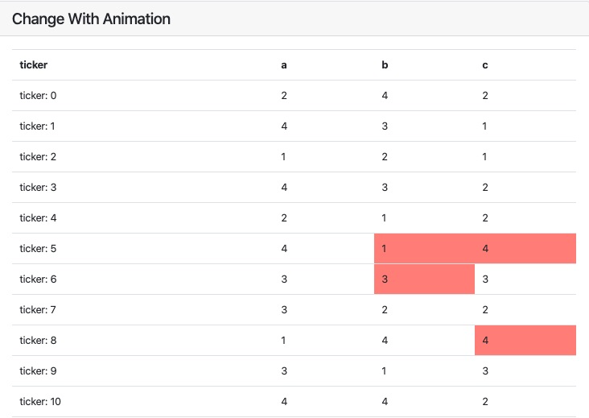
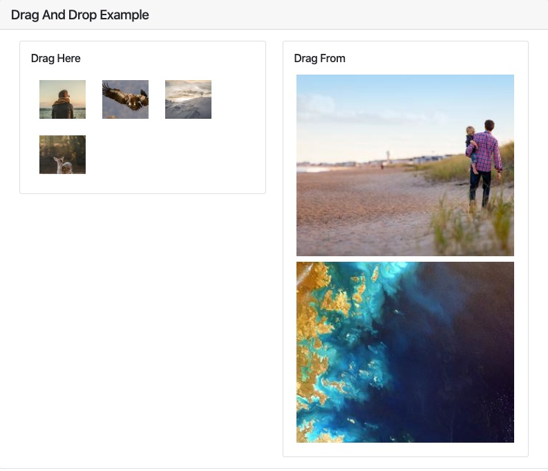

# Example List

## Clock Example
example-clock.html
## A simple example for click event
example-events.html
## Filter, sort a table data
[More info](example-filter-sort-table-ajax-data.md) 
## Table generator
example-generate_table.html
## This is an example uses a movie api.
example-movie-list.html
## example-rendering.html
example-rendering.html
## example-simple.html
example-simple.html
## Todo List Example
example-todo-list.html
## Web Socket Example
example-websocket.html
## Getting Movie List From Firebase
[Script File](../src/examples/Firebase)
## Change Each Row With Animation
[Script File](../src/examples/change-with-animation.js)

## Drag And Drop Example

[Script File](../src/examples/drag_and_drop_example.js)
 

